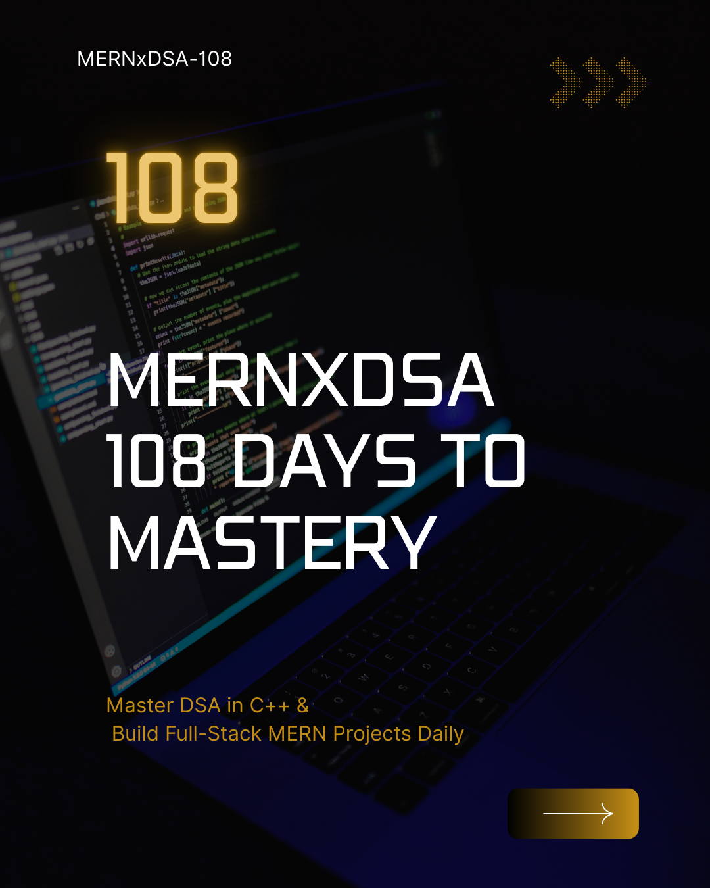

# MERNxDSA: 108 Days to Mastery 🚀

Welcome to my **108-day coding journey** — focused on mastering:

- 💻 Data Structures & Algorithms in C++
- 🌐 Full-Stack Web Development using the MERN Stack

## 🔥 Challenge Goal

To solve DSA problems + build MERN apps daily for 108 days straight and become a confident full-stack developer & problem solver.

## 📅 DSA (C++) Daily Log

| Day | Topics / Problems Solved      | Notes                           |
| --- | ----------------------------- | ------------------------------- |
| 1   | singlyLinkedList (3 problems) | [Day01](DSA_C++/Day01/singlyLL) |
| 2   | 3 leetcode problems           | [Day02](DSA_C++/Day02)          |

## 💻 MERN Stack Daily Log

| Day | Topics / Work Done | Notes                                     |
| --- | ------------------ | ----------------------------------------- |
| 1   | RESTAPIs           | [Day01](MERN_STACK/Day01/DummyProjetcts/) |
| 2   | PAYTM CLONE        | [Day02](MERN_STACK/Day02/)                |

## 📌 Hashtag

**Follow on LinkedIn:**[Nandkishor-Pal](https://www.linkedin.com/in/nandkishor-pal)

📌 LeetCode Profile

Explore my DSA solutions and progress:

**LeetCode Profile:** [Nandkishor_pal](https://leetcode.com/u/Nandkishor_pal/)

## 💻 Tech Stack

- **DSA**: C++ (STL, recursion, sorting, trees, graphs)
- **MERN**: MongoDB, Express, React, Node.js

## 🧠 Why This Challenge?

Because consistent effort wins. Every. Single. Time.

Made with 💻 by [Nandkishor Pal](https://github.com/Nandkishor786)
